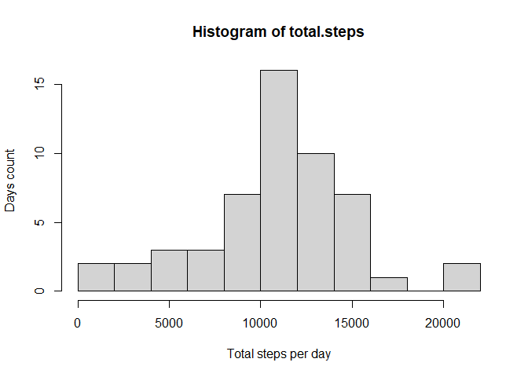
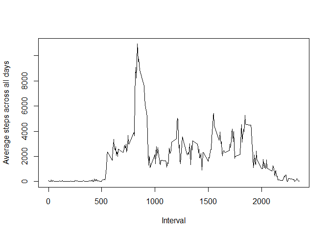
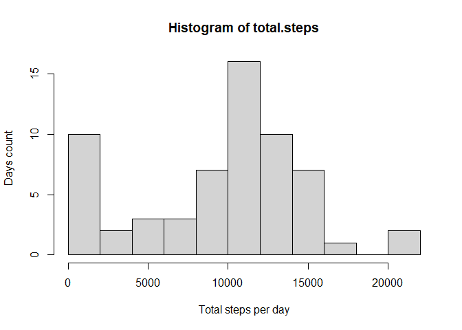
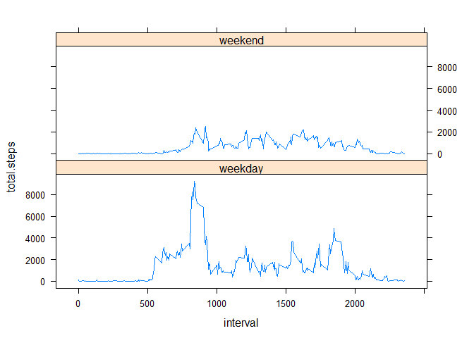

## Loading and preprocessing the data


```r
library(readr)
library(dplyr)
library(lattice)
```

To load the data I'm using a "readr" package.


```r
data <- read_csv("activity.zip")
```

```
## Parsed with column specification:
## cols(
##   steps = col_double(),
##   date = col_date(format = ""),
##   interval = col_double()
## )
```

```r
str(data)
```

```
## tibble [17,568 x 3] (S3: spec_tbl_df/tbl_df/tbl/data.frame)
##  $ steps   : num [1:17568] NA NA NA NA NA NA NA NA NA NA ...
##  $ date    : Date[1:17568], format: "2012-10-01" "2012-10-01" ...
##  $ interval: num [1:17568] 0 5 10 15 20 25 30 35 40 45 ...
##  - attr(*, "spec")=
##   .. cols(
##   ..   steps = col_double(),
##   ..   date = col_date(format = ""),
##   ..   interval = col_double()
##   .. )
```


## What is mean total number of steps taken per day?

To easily chain the methods calls I'm using here a "dplyr" package.
At first, I filter out NA values, then group the remaining values by date.
With the "summarise" function I get a new "total.steps" variable for each group.


```r
dataByDays <- data %>%
  filter(!is.na(steps)) %>%
  group_by(date) %>%
  summarise(total.steps = sum(steps))

str(dataByDays)
```

```
## tibble [53 x 2] (S3: tbl_df/tbl/data.frame)
##  $ date       : Date[1:53], format: "2012-10-02" "2012-10-03" ...
##  $ total.steps: num [1:53] 126 11352 12116 13294 15420 ...
```


```r
with(dataByDays, hist(
  total.steps,
  xlab = "Total steps per day",
  ylab = "Days count",
  breaks = 15))
```

<!-- -->

From the histogram we see that most frequently people are doing 10-15k steps per day.
This fact is clearly seen after calculating the mean and median of total steps per day.


```r
mean(dataByDays$total.steps)
```

```
## [1] 10766.19
```


```r
median(dataByDays$total.steps)
```

```
## [1] 10765
```

## What is the average daily activity pattern?

To analyze the average daily activity pattern I'm filtering out the NA values, 
grouping the data by interval and using a "summarise" function to get the average 
number of steps taken, averaged across all days.


```r
dataByInterval <- data %>%
  filter(!is.na(steps)) %>%
  group_by(interval) %>%
  summarise(total.steps = sum(steps))
```

```
## `summarise()` ungrouping output (override with `.groups` argument)
```

```r
str(dataByInterval)
```

```
## tibble [288 x 2] (S3: tbl_df/tbl/data.frame)
##  $ interval   : num [1:288] 0 5 10 15 20 25 30 35 40 45 ...
##  $ total.steps: num [1:288] 91 18 7 8 4 111 28 46 0 78 ...
```


```r
with(dataByInterval, plot(
  interval,
  total.steps,
  type = "l",
  xlab = "Interval",
  ylab = "Average steps across all days"))
```

<!-- -->

From the plot we see that the most active time during the day is 8-9 AM.
The maximum value is observed at 8:35 AM.


```r
max <- dataByInterval %>% 
  filter(total.steps == max(total.steps)) %>%
  select(interval)

max[[1]]
```

```
## [1] 835
```

## Imputing missing values

The input data contains 2304 observations with missing steps values.


```r
sum(is.na(data$steps))
```

```
## [1] 2304
```

To use such observations I'm going to impute the missing data by setting median 
values of steps of according intervals instead of the NAs.


```r
dataFixed <- data %>%
  group_by(interval) %>%
  mutate(steps = ifelse(is.na(steps), median(steps, na.rm = T), steps))
```

Here I repeat the actions from first investigation to investigate the average 
daily activity pattern with imputed data.


```r
dataByDaysFixed <- dataFixed %>%
  group_by(date) %>%
  summarise(total.steps = sum(steps))

str(dataByDaysFixed)
```

```
## tibble [61 x 2] (S3: tbl_df/tbl/data.frame)
##  $ date       : Date[1:61], format: "2012-10-01" "2012-10-02" ...
##  $ total.steps: num [1:61] 1141 126 11352 12116 13294 ...
```


```r
with(dataByDaysFixed, hist(
  total.steps,
  xlab = "Total steps per day",
  ylab = "Days count",
  breaks = 15))
```

<!-- -->

After taking into account the imputed data we see that there are quite a lot of
days with number of steps <2k. But this fact didn't change the mean and median a lot.


```r
mean(dataByDaysFixed$total.steps)
```

```
## [1] 9503.869
```


```r
median(dataByDaysFixed$total.steps)
```

```
## [1] 10395
```


## Are there differences in activity patterns between weekdays and weekends?

To investigate the differences in activity patterns between weekdays and weekends
I introduced a variable "weekends" and added a new factor variable "day.type" 
to the dataset. The new "day.type" variable indicates if the activity was performed 
on weekday or weekend.


```r
Sys.setlocale("LC_TIME", "C")
```

```
## [1] "C"
```

```r
weekends <- c('Saturday', 'Sunday')

dataFixed <- dataFixed %>%
  mutate(day.type = factor((weekdays(date) %in% weekends),
    levels=c(FALSE, TRUE), labels=c("weekday", "weekend")))
```

Next I perform grouping by the type of day and interval and summarizing total steps.


```r
dataByDayTypes <- dataFixed %>%
  group_by(day.type, interval) %>%
  summarise(total.steps = sum(steps))
```

```
## `summarise()` regrouping output by 'day.type' (override with `.groups` argument)
```

```r
xyplot(total.steps ~ interval | day.type, data=dataByDayTypes, type = "l", layout = c(1,2))
```

<!-- -->

From the plot it's clearly seen that on weekdays people are more active that is
indicated by the number of steps ranging from 2k to 4k on average. 
On other hand the activity is quite small on weekends, t.e. 0-2k steps.
